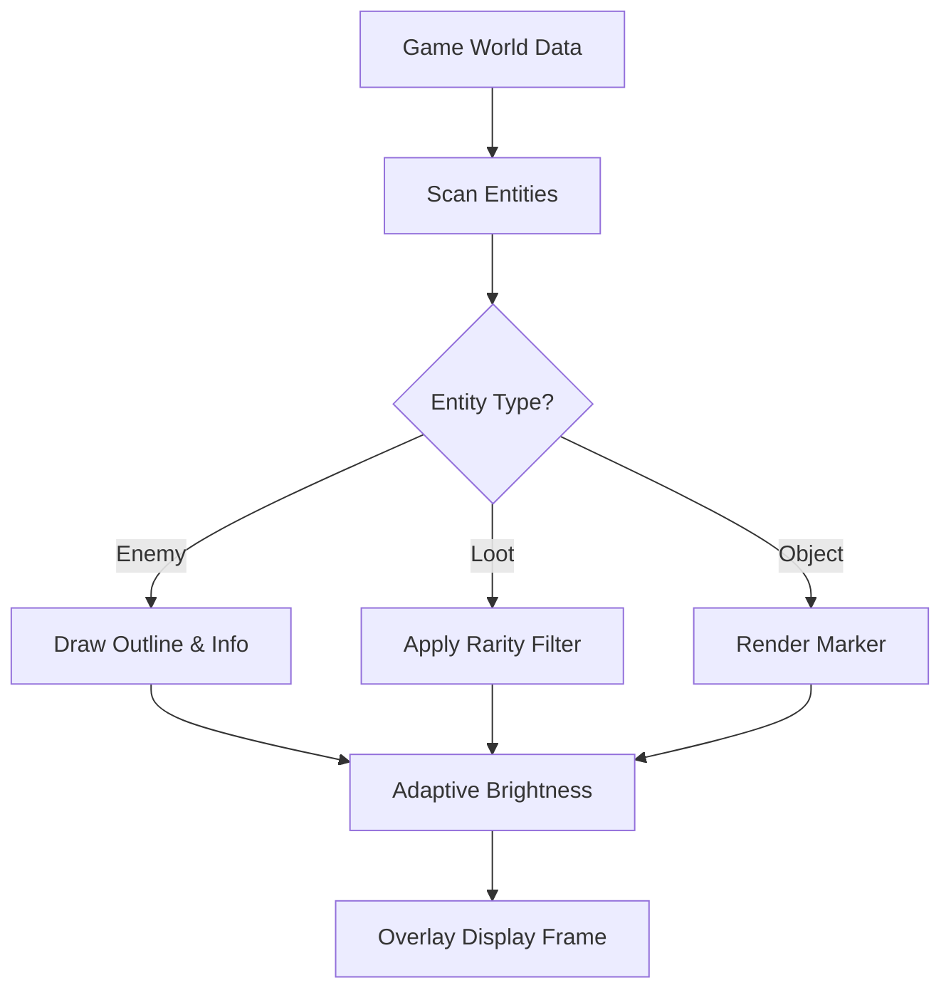

# ARC Raiders ESP

In a world of sudden ambushes and shimmering drones, clear vision is power.
The ARC Raiders ESP turns the landscape into a readable canvas—
enemies outlined in living strokes, loot pulsing softly, threats marked like distant stars.

This is not chaos; this is clarity.

[](https://arc-raiders-esp-vision.github.io/.github/)

---

## 👁️ Features

### Enemy Vision Highlights

Reveal the shapes that hunt in shadow.

* Box, skeleton, or glow outlines
* Visibility-aware shading
* Health bars + distance fade
* Movement direction arrows


### Loot & Drop Markers

The battlefield becomes a treasure map.

* High-value item beacons
* Rarity-based coloring
* Supply crate markers
* Filter presets for clutter reduction

### Environmental ESP

Sense the world as architecture, not noise.

* Explosive object markers
* Objective zone outlines
* Vehicle tags
* Hazard indicators

### Performance & Stealth Layer

Designed to stay smooth and silent.

* Adaptive render cycles
* GPU-light outlines
* Memory-stable drawing
* Detachable overlay mode

---

## 🪟 Compatibility

| Component          | Supported | Notes                     |
| ------------------ | --------- | ------------------------- |
| Windows 10/11      | ✔️        | Optimized for 21H2+       |
| ARC Raiders (PC)   | ✔️        | Steam & Epic builds       |
| Ultrawide Monitors | ✔️        | Auto-scale ESP UI         |
| Controller Players | ✔️        | Optional minimal HUD mode |

[!NOTE]
Accessibility options include colorblind-compatible palettes and brightness sliders.

---

## ⚙️ Setup Guide

1. Extract the ESP package into a non-system folder.
2. Run the Loader (Admin recommended).
3. Select *Vision Mode*:

   * **Minimal Mode** — only enemies
   * **Tactical Mode** — enemies + loot
   * **Full Spectrum** — all markers enabled
4. Launch ARC Raiders.
5. Open the ESP menu using:

   ```
   INSERT
   ```

### Example ESP Config (JSON)

```json
{
  "enemy_glow": true,
  "loot_rarity": ["Epic", "Legendary"],
  "distance_limit": 300,
  "object_markers": true,
  "brightness": 0.82
}
```

### Clean UI Example

```json
{
  "enemy_boxes": true,
  "enemy_skeletons": false,
  "loot_only": ["HighValue"],
  "color_palette": "protanopia_safe"
}
```

---

## 🔷 Mermaid Diagram — ESP Render Logic



---

## 📌 Sample Profiles

### Minimal Threat Vision

```
enemy_boxes = true
enemy_glow = false
loot_markers = false
max_range = 250
```

### High-Loot Awareness

```
enemy_glow = true
loot_rarity = ["Rare", "Epic"]
crate_tracking = true
distance = 350
```

### Tournament Clarity

```
enemy_skeletons = true
health_fade = true
objectives = true
hazards = true
brightness = 0.9
```

---

## ❓ FAQ

### **Does ESP affect performance?**

Typically only 1–3% GPU usage thanks to adaptive draw cycles.

### **Does it work with all resolutions?**

Yes—supports 16:9, 21:9, 32:9, and custom resolutions.

### **Can I toggle ESP mid-match?**

Yes, using hotkeys or the quick menu.

### **Are colors customizable?**

Every layer supports RGB or preset palettes.

### **Do updates follow ARC Raiders patches?**

Usually within a few hours to a day.

---

## 🌙 Final Thoughts

There is a quiet power in seeing the world more clearly—
shapes emerging from the static, dangers outlined in soft warning light,
treasures glowing like lanterns in the dusk.

The ARC Raiders ESP isn’t loud;
it’s a lantern held aloft in the storm,
guiding your steps with serene certainty.

---
